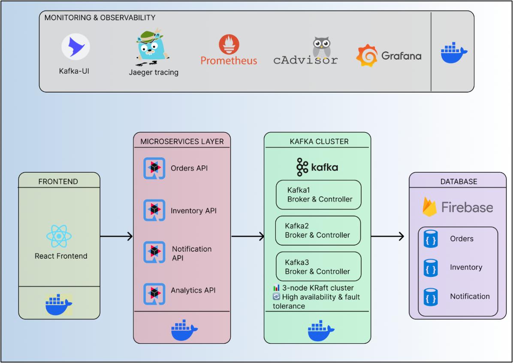

# E-Commerce Microservices avec Quarkus, Kafka et Observabilité

[](https://quarkus.io/)
[](https://kafka.apache.org/)
[](https://openjdk.org/)
[](https://reactjs.org/)
[](https://vitejs.dev/)

Architecture microservices complète pour une plateforme e-commerce avec **Quarkus**, **Kafka KRaft**, **Observabilité** et déploiement GCP.

## 🚀 Fonctionnalités Principales

- **Cluster Kafka KRaft** (3 nodes)
- **Services Backend** (Quarkus + Java 21)
  - Service Commandes
  - Service Inventaire
  - Service Notifications
  - Service Analytics
- **Frontend** (React + Vite)
- **Stack Observabilité Complète**:
  - Prometheus + Grafana
  - Jaeger (Tracing)
  - cAdvisor + Node Exporter
- **Déploiement GCP** (Terraform)
- **Kafka UI** pour monitoring

---

## 📊 Architecture Globale



---

## 🛠️ Stack Technologique

| Composant               | Description                                  | Ports |
|-------------------------|----------------------------------------------|-------|
| **Kafka Cluster**       | 3 nodes KRaft (sans Zookeeper)              | 9092-9097 |
| **Orders API**          | Service de commandes (Quarkus)              | 8080  |
| **Inventory Service**   | Gestion stock avec tracing OpenTelemetry    | 8084  |
| **Notification Service**| Envoi de notifications                      | 8083  |
| **Analytics Service**   | Analyse des données en temps réel           | 8085  |
| **Frontend**           | Interface React/Vite                        | 3002  |
| **Kafka UI**           | Interface de gestion Kafka                  | 8081  |
| **Prometheus**         | Collecte de métriques                       | 9090  |
| **Grafana**            | Visualisation des métriques                 | 3000  |
| **Jaeger**             | Tracing distribué                           | 16686 |
| **cAdvisor**           | Monitoring des containers                   | 8082  |
| **Node Exporter**      | Métriques système                           | 9100  |

---

## 🏗️ Infrastructure GCP (Terraform)

```hcl
resource "google_compute_instance" "vm" {
  name         = "monitoring-vm"
  machine_type = "e2-standard-2"
  
  boot_disk {
    initialize_params {
      image = "ubuntu-os-cloud/ubuntu-2204-lts"
    }
  }

  network_interface {
    network    = "default"
    access_config {}
  }
}

resource "google_compute_firewall" "allow-all-ports" {
  name    = "allow-all-ports"
  network = "default"

  allow {
    protocol = "tcp"
    ports    = ["80", "443", "3000", "3002", "8080-9099", "16686"]
  }
}
```

---

## 🐳 Services Docker

### Cluster Kafka KRaft
```yaml
kafka1:
  image: bitnami/kafka:latest
  environment:
    - KAFKA_CFG_PROCESS_ROLES=broker,controller
    - KAFKA_CFG_NODE_ID=1
    - KAFKA_CFG_LISTENERS=PLAINTEXT://:9092,CONTROLLER://:9093
    - KAFKA_CFG_ADVERTISED_LISTENERS=PLAINTEXT://kafka1:9092
```

### Services Quarkus
```yaml
inventory-service:
  build: ./api/inventorys/inventory-service
  environment:
    - KAFKA_BOOTSTRAP_SERVERS=kafka1:9092,kafka2:9092,kafka3:9092
    - QUARKUS_OTEL_EXPORTER_OTLP_TRACES_ENDPOINT=http://jaeger:4317
```

### Monitoring
```yaml
grafana:
  image: grafana/grafana
  volumes:
    - ./grafana/dashboards:/var/lib/grafana/dashboards
  ports:
    - "3000:3000"
```

---

## 🔌 Configuration Kafka

### Exemple pour Order Service
```properties
mp.messaging.outgoing.orders-out.connector=smallrye-kafka
mp.messaging.outgoing.orders-out.topic=orders
kafka.bootstrap.servers=kafka1:9092,kafka2:9092,kafka3:9092
```

### Consommation dans Inventory Service
```java
@Incoming("orders-in")
public void processOrder(Order order) {
    inventory.updateStock(order);
    metrics.orderProcessed(order); // Métriques Prometheus
}
```

---

## 📈 Observabilité

### Dashboards Grafana
1. **Métriques JVM**: `http://localhost:3000/d/jvm-metrics`
2. **Kafka Cluster**: `http://localhost:3000/d/kafka-overview`
3. **Tracing Jaeger**: `http://localhost:16686`


---

## 🚀 Déploiement

### 1. Initialiser l'infrastructure GCP
```bash
terraform init
terraform apply -var="project=votre-projet-gcp"
```

### 2. Démarrer les services
```bash
docker-compose up -d --build
```

### 3. Accéder aux interfaces
| Service       | URL                          |
|---------------|------------------------------|
| Frontend      | http://localhost:3002        |
| Kafka UI      | http://localhost:8081        |
| Grafana       | http://localhost:3000        |
| Jaeger UI     | http://localhost:16686       |

---

## 🛠️ Développement Local

### Lancer un service Quarkus
```bash
cd api/orders/orders-api
mvn quarkus:dev -Ddebug=5006
```

### Tester le flux Kafka
```bash
curl -X POST http://localhost:8080/orders \
  -H "Content-Type: application/json" \
  -d '{"productId": "123", "quantity": 2}'
```

### Vérifier les traces
Ouvrir Jaeger pour voir le flux entre services:
```
http://localhost:16686/search
```

---

## 📂 Structure des Fichiers

```
.
├── api/
│   ├── orders/              # Service des commandes
│   ├── inventorys/          # Gestion du stock
│   ├── notifications/       # Service de notifications
│   └── analytics/           # Analyse des données
├── frontend/                # Application React/Vite
├── config/
│   ├── prometheus/          # Configuration Prometheus
│   └── grafana/             # Dashboards Grafana
├── terraform/               # Scripts d'infrastructure GCP
└── docker-compose.yml       # Configuration Docker complète
```

---

## 🤝 Contribution

1. Forker le projet
2. Créer une branche (`git checkout -b feature/nouvelle-fonctionnalite`)
3. Committer (`git commit -m 'Ajout d'une super fonctionnalité'`)
4. Pusher (`git push origin feature/nouvelle-fonctionnalite`)
5. Ouvrir une Pull Request

---
## 👥 Contributors (3)

- [@FilleuxStudio](https://github.com/FilleuxStudio) - FilleuxStudio Filleux  
- [@NoahGallo](https://github.com/NoahGallo) - NoahGallo  
- [@KylianFroment](https://github.com/KylianFroment) - KylianFroment Kylian  

---

