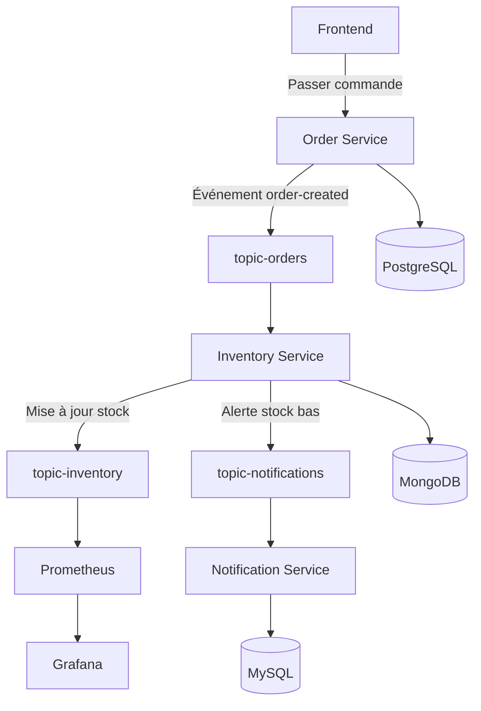

# E-Commerce Microservices avec Quarkus et Kafka

[](https://quarkus.io/)
[](https://kafka.apache.org/)
[](https://www.docker.com/)

Une architecture microservices pour une plateforme e-commerce utilisant **Quarkus**, **Kafka** et **Docker**.  
🚀 **Fonctionnalités clés** : Gestion des commandes, suivi d'inventaire en temps réel, notifications automatisées et surveillance complète.

---

## 📦 Architecture


```mermaid
graph TD
  A[Frontend] -->|Passer commande| B[Order Service]
  B -->|Événement order-created| C[topic-orders]
  C --> D[Inventory Service]
  D -->|Mise à jour stock| E[topic-inventory]
  D -->|Alerte stock bas| F[topic-notifications]
  F --> G[Notification Service]
  B --> H[(PostgreSQL)]
  D --> I[(MongoDB)]
  G --> J[(MySQL)]
  E --> K[Prometheus]
  K --> L[Grafana]
```

---

## 🛠️ Technologies

| Composant               | Rôle                                                                 |
|-------------------------|----------------------------------------------------------------------|
| **Quarkus**             | Framework Java pour microservices légers                            |
| **Apache Kafka**        | Orchestration des événements entre services                         |
| **PostgreSQL**          | Base de données des commandes                                       |
| **MongoDB**             | Stockage des données d'inventaire                                   |
| **Prometheus/Grafana**  | Surveillance des métriques et visualisation                         |
| **Docker Compose**      | Déploiement local de l'infrastructure                               |

---

## 🔍 Fonctionnement des Microservices

### 1. **Service de Commandes** (`order-service`)
- **Endpoint** : `POST /orders` (Crée une commande)
- **Kafka** : Produit des événements dans `topic-orders`
- **Base de données** : PostgreSQL

```java
@POST
public Response createOrder(Order order) {
    orderRepository.persist(order);
    kafkaEmitter.send(order); // → topic-orders
}
```

### 2. **Service d'Inventaire** (`inventory-service`)
- **Abonnement Kafka** : `topic-orders` (consomme les commandes)
- **Action** : Met à jour le stock et publie des alertes dans `topic-notifications`

```java
@Incoming("orders-in")
public void updateStock(Order order) {
    inventory.decrementStock(order.productId());
    if (inventory.isLowStock()) {
        alertsEmitter.send("Stock bas: " + order.productId()); // → topic-notifications
    }
}
```

### 3. **Service de Notifications** (`notification-service`)
- **Abonnement Kafka** : `topic-notifications`
- **Actions** : Envoi d'e-mails/SMS via SendGrid ou Twilio

```java
@Incoming("notifications-in")
public void sendAlert(String alert) {
    emailService.send("admin@store.com", "Alerte Stock", alert);
}
```

---

## 🚀 Installation

### Prérequis
- Docker 24+
- JDK 17+
- Maven 3.9+

### 1. Cloner le dépôt

```bash
git clone https://github.com/yourusername/ecommerce-microservices.git
cd ecommerce-microservices
```

### 2. Démarrer l'infrastructure

```bash
docker-compose up -d  # Kafka, PostgreSQL, MongoDB, Prometheus, Grafana
```

### 3. Lancer les microservices

```bash
mvn quarkus:dev -pl order-service
mvn quarkus:dev -pl inventory-service
mvn quarkus:dev -pl notification-service
```

---

## 📊 Monitoring

### Dashboard Grafana
Accédez à [http://localhost:3000](http://localhost:3000) (admin/admin) et importez :
- **ID 14370** : Métriques JVM Quarkus
- **ID 7589** : Surveillance Kafka


### Métriques clés
- `orders_created_total` : Nombre total de commandes
- `inventory_items_remaining` : Stock restant par produit
- `kafka_consumer_messages_consumed_total` : Messages Kafka traités

---

## 🌐 API Endpoints

| Service               | Endpoint                  | Méthode | Description                          |
|-----------------------|---------------------------|---------|--------------------------------------|
| **Order Service**     | `/orders`                 | POST    | Crée une commande                    |
| **Inventory Service** | `/inventory/{productId}`  | GET     | Récupère le stock d'un produit       |
| **Notification Service** | `/notifications`       | GET     | Liste des notifications envoyées     |

---

## 🔄 Workflow de Développement

1. **Quarkus Dev Services** : Provisionne automatiquement Kafka et les BDD en dev.
2. **Tests Locaux** : 

```bash
curl -X POST -H "Content-Type: application/json" -d '{"productId": "123", "quantity": 2}' http://localhost:8080/orders
```
3. **Déploiement** : 

```bash
mvn clean package -Dquarkus.container-image.build=true
docker-compose --profile prod up -d
```

---

## 📚 Ressources

- [Documentation Kafka](https://kafka.apache.org/documentation/)
- [Guide Quarkus + Kafka](https://quarkus.io/guides/kafka)
- [Exemple de Dashboard Grafana](https://grafana.com/grafana/dashboards/14370)

---

## 🤝 Contribution
1. Forkez le projet
2. Créez une branche (`git checkout -b feature/amazing-feature`)
3. Committez vos changements (`git commit -m 'Add some amazing feature'`)
4. Pushez (`git push origin feature/amazing-feature`)
5. Ouvrez une Pull Request

---

### 📥 Configuration des Fichiers Clés

1. **`docker-compose.yml`** :

```yaml
version: '3'
services:
  zookeeper:
    image: confluentinc/cp-zookeeper:7.3.0
    ports: ["2181:2181"]

  kafka:
    image: confluentinc/cp-kafka:7.3.0
    depends_on: [zookeeper]
    ports: ["9092:9092"]
    environment:
      KAFKA_AUTO_CREATE_TOPICS_ENABLE: 'true'
      KAFKA_ADVERTISED_LISTENERS: PLAINTEXT://kafka:9092

  postgres:
    image: postgres:15
    environment:
      POSTGRES_DB: orders
      POSTGRES_USER: quarkus
      POSTGRES_PASSWORD: quarkus

  grafana:
    image: grafana/grafana:latest
    ports: ["3000:3000"]
```

2. **`application.properties`** (exemple pour Order Service) :

```properties
quarkus.datasource.jdbc.url=jdbc:postgresql://postgres:5432/orders
quarkus.datasource.username=quarkus
quarkus.datasource.password=quarkus

mp.messaging.outgoing.orders-out.connector=smallrye-kafka
mp.messaging.outgoing.orders-out.topic=orders
kafka.bootstrap.servers=kafka:9092
```